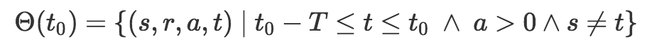
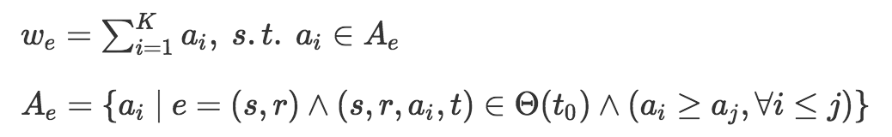
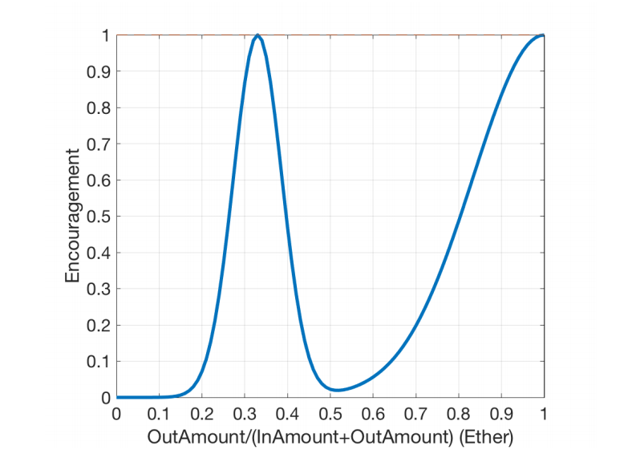

# Nebulas Rank

***nr.scala*** is an implementation of **Nebulas Rank** algorithm, which is described in <a href="https://nebulas.io/docs/NebulasTechnicalWhitepaper.pdf">Nebulas Technical Whitepaper</a>.

> **Note: Nebulas Rank algorithm** is being improved continuously.


## 1. Getting Started

### 1.1 Runtime Environment

Download <a href="https://spark.apache.org">Apache Spark</a>. Let ***$spark_home*** be the folder of the downloaded Spark release.

### 1.2 Prepare Transactions Data

Let ***txs.txt*** be the input data file. Put it in your working directory, named as ***$wd***.

You can download <a href="https://www.dropbox.com/s/7ludeg2eu2rf68i/2017July.txt.tar.bz2?dl=0">sample input</a>, which is **the Ethereum transaction set of July, 2017**. You need to rename the extracted file to txs.txt. Or you can also extract the transactions from blockchain storage by yourself, using the same format.

> Following is the format of ***txs.txt***:
>
> - Every line represents a transaction.
> - There are five columns in each transaction: **<u>type</u>, <u>from</u>, <u>to</u>, <u>time</u>, <u>amount</u>.** The file is in the form of csv without header. Following is the explanation of each column.
>   - **type**:  type = 0 if the target address is an individual;  type = 1 if the target address is a smart contract.
>   - **from**: the source address of the transfer, denoted by *s*
>   - **to**: the target address of the transfer, denoted by *r*
>   - **time**: the timestamp of the transfer, denoted by *t*
>   - **amount**: the amount of the transfer, denoted by *a*

### 1.3 Execute the script

Set working directory **$wd** in ***nr.scala***

  ```scala
  val wd = "/data/"
  ```

Run the following command
```bash
# You can limit the resource  allocation by changing spark-shell's parameters.
$spark_home/bin/spark-shell --driver-memory 12G --executor-memory 12G -i nr.scala
```

> Check result in ***$wd/nr.txt***.
>
> - There are two columns: **<u>address</u>, <u>score</u>**.
>   - **address:** node's address.
>   - **score:** node's rank score (higher better).
>
> - Sample Output is as follows:
>
>   ```csv
>   0x0ee4e2d09aec35bdf08083b649033ac0a41aa75e	0.16764104077289738
>   0x027beefcbad782faf69fad12dee97ed894c68549	0.16719086187369248
>   0xf195cac8452bcbc836a4d32cfb22235af4ac1e9c	0.023650377134761345
>   0x94435d12c51e19d5b5c8656763f9069d37791a1a	0.02165891839121156
>   0x0003717bf8b1fc8cd97ecb6fffd59cb046b3c73e	0.018570459097939924
>   0x752975f5990c33da38c4cd50f0a41b70b3a6796c	0.01644191070061694
>   0x5816c2687777b6d7d2a2432d59a41fa059e3a406	0.015255009692124169
>   0x707fb1de84382065f2d4748138c257de70dbe578	0.015226830731017039
>   0x267be1c1d684f78cb4f6a176c4911b741e4ffdc0	0.014219728527383057
>   0x7fa9ab2e5d0c6f294e53dbb911e529b46b4d7a7d	0.01348815212875536
>   0xa53e0ca7d246a764993f010d1fde4ad01189f4e6	0.012644731454055438
>   0xf259e51f791e9ed26e89b6cae4a7c6296bfbd0b8	0.012642438027433298
>   0x7ea5e875a386b66d11a0ad1866ca7b5f2745f049	0.01045796847712372
>   0x7580ba923c01783115d79975d6a41b3d38eff8d5	0.00774160222263565
>   0xf6230e7e98d2bbebf96d14888020e9c3e8c27d69	0.007202338908948566
>   ```
>
>   ​


## 2. Algorithm

### 2.1 Configuration
Set parameters by modifying values in ***nr.scala***
- **alpha, beta, mu, lambda:** same as α, β, μ, λ in the <a href="https://nebulas.io/docs/NebulasTechnicalWhitepaper.pdf">whitepaper</a>
- **topK:** same as K in the <a href="https://nebulas.io/docs/NebulasTechnicalWhitepaper.pdf">whitepaper</a>
- For example

  ```scala
  val alpha = 2
  val beta = 0.1
  val mu = 0.01
  val lambda = 2
  val topK = 2
  ```

### 2.2 Computing

There are 8 steps when computing **Nebulas Rank**:

**Step1**: Filter valid transactions, by formula (Formula (1) in the <a href="https://nebulas.io/docs/NebulasTechnicalWhitepaper.pdf">whitepaper</a>)
> 

**Step2**: Get edge weigh by top transaction amounts, by formula (Formula (2)(3) in the <a href="https://nebulas.io/docs/NebulasTechnicalWhitepaper.pdf">whitepaper</a>)
> 

**Step3**: For each node,

-  compute its coinage by method **getCoinage(.)**.

-  compute its encouragement value by method **getEncouragement(.)**, shown as follows:
  

-  compute its max historical balance by method **getRealBalance(.)**.

> See the code for detailed algorithm. All results are normalized.

**Step4**: Reduce edges weight by their target nodes' properties computed in **Step3**.

**Step5**: Limit the out edges' weight of each node by its in edges' weight. The correponding method is **limit(.)**

**Step6**: Take the largest weakly connected component of the graph, by method **wgc(.)**.

**Step7**: Add ground node and its corresponding edges into the graph, by method **addGnd(.)**.

**Step8**: Compute the steady probabilities of Markov chain by power iteration. The corresponding method is **rank(.)**.

---

> For more details, please check <a href="https://nebulas.io/docs/NebulasTechnicalWhitepaper.pdf">Nebulas Technical Whitepaper</a> and <a href="https://github.com/nebulasio/nebulas_gitlab/blob/master/nr/nr.scala">nr.scala</a>
